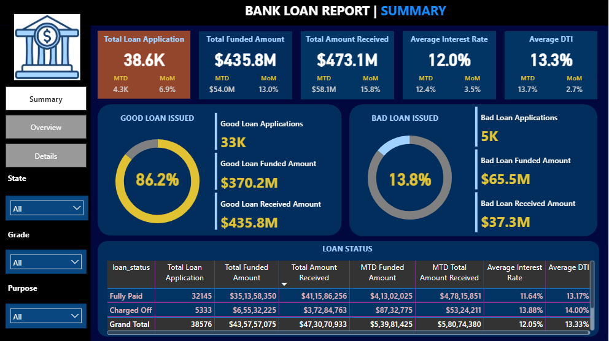
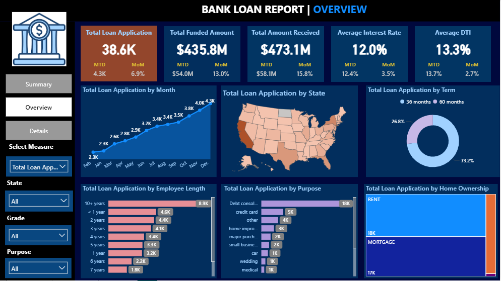
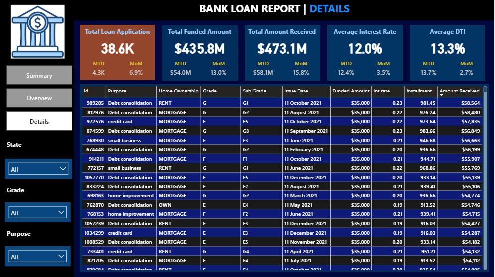

# Bank Loan Analysis

## Overview

This project focuses on analyzing bank loan data to understand loan performance, customer behavior, and risk patterns.
The analysis is performed using SQL for querying, Power Query Editor for data transformation, and Power BI for interactive dashboard visualization.

The dashboard provides insights into good vs bad loans, funded amounts, interest rates, DTI, and loan trends across states, purposes, tenure, and customer profiles.

## Objectives

* Analyze overall loan applications and funding performance
* Identify good and bad loan distribution
* Monitor interest rate and DTI trends
* Understand customer behavior by state, purpose, and employment length
* Support data-driven decision-making using interactive dashboards

 ## Project Workflow

**SQL Querying (First Step)**
* SQL queries are performed first for each analysis
* Data is filtered, aggregated, and structured for reporting
* Metrics such as total applications, funded amount, and loan status are extracted

**Data Transformation (Power Query Editor)**
* Cleaning and transforming the extracted data
* Handling missing values
* Standardizing column formats

**Data Modeling & Visualization (Power BI)**
* DAX measures developed for KPIs
* Interactive dashboards built for Summary, Overview, and Details

## Tools & Technologies Used

* SQL – Data extraction and analysis for each metric
* Power Query Editor – Data cleaning and transformation
* Power BI – Data modeling and dashboard visualization
* DAX – Measures and calculated KPIs

## Dashboards Description

**Summary Dashboard**
Provides a high-level overview of loan performance:
* Total Loan Applications
* Total Funded Amount
* Total Amount Received
* Average Interest Rate
* Average DTI
* Good vs Bad Loan Distribution
* Loan Status Summary Table

**Overview Dashboard**
Focuses on trends and distributions:
* Monthly loan application trend
* Loan applications by state (map)
* Loan applications by term (36 vs 60 months)
* Loan applications by employment length
* Loan applications by purpose
* Loan applications by home ownership

**Details Dashboard**

Provides record-level insights:
* Individual loan details
* Loan amount, interest rate, installment
* Issue date and repayment information
* Fully paid vs charged-off loans

## Key Insights

* Majority of loans fall under good loan category
* Debt consolidation is the most common loan purpose
* Longer employment length shows higher loan approval
* Charged-off loans have higher interest rates and DTI
* Certain states contribute significantly to loan volume

## Conclusion

The analysis provides clear insights into loan performance, showing that most loans are well-performing while charged-off loans carry higher risk due to increased interest rates and DTI.

## Recommendation

* Focus on low-risk borrower segments to improve loan portfolio quality
* Closely monitor high-interest and high-DTI loans to reduce defaults
* Strengthen credit assessment and approval criteria
* Promote better-performing loan purposes and regions
* Use Power BI dashboards regularly for data-driven lending decisions

## Dashboards

